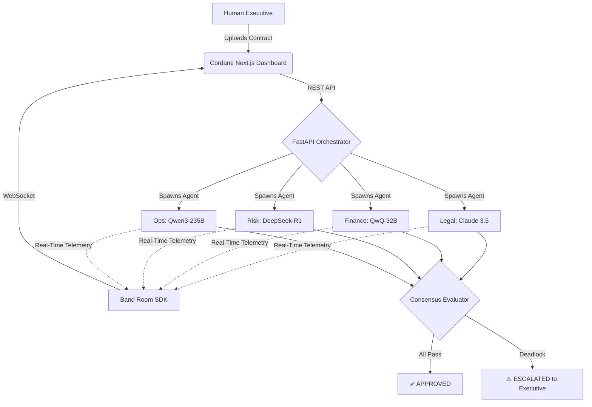

  
  <h1>Cordane.</h1>
  
<b>Your Autonomous Enterprise Advisory Board. Built for the Band of Agents Hackathon.</b>

  
  

    
    
    
    
  

---

## 🏆 The Vision

In the real world, enterprise contract approvals stall because Legal, Finance, Risk, and Operations teams email in endless circles. **Cordane eliminates this bottleneck.**

Cordane is a deterministic, multi-agent consensus engine. You drop a vendor contract on the table, and four specialized AI agents instantly cross-examine the terms, debate the risks, and negotiate a unified verdict. Instead of replacing humans, Cordane does the heavy lifting so executives only intervene when absolute deadlock occurs.

## 🎯 Partner Hackathon Bounties Targeted

To prove that Cordane is an enterprise-grade, model-agnostic architecture, we strategically integrated best-in-class models using the hackathon's exact partner bounties:

| Department | Model | Partner Provider | Rationale |
| :--- | :--- | :--- | :--- |
| ⚖️ **Legal** | `Claude Sonnet 4.6` | **AI/ML API** | Superior at parsing dense indemnification clauses and legal nuance. |
| 💰 **Finance** | `QwQ-32B` | **AI/ML API** | Exceptionally fast numerical reasoning for margin analysis. |
| 🛡️ **Risk** | `DeepSeek-R1` | **AI/ML API** | Robust reasoning for global compliance and vulnerability auditing. |
| ⚙️ **Ops** | `Qwen3-235B` | **Featherless** | Massive parameter density to analyze SLA integration timelines. |

## 🧠 System Architecture

Unlike standard AI chatbots, Cordane uses a **Deterministic Consensus Mesh**. The agents do not run in isolated silos; they actively read each other's outputs and adjust their strict thresholds based on cross-departmental constraints.

## 🔌 Band SDK Integration (Track 1)

Cordane was built to solve a critical **Track 1: Internal Enterprise Workflow**. We didn't just wrap the Band API; we heavily utilized the official `band-sdk` (v1.0.0) to bridge our deterministic Python state machine with the live collaborative network.

1. **Async Mesh Execution:** The FastAPI backend runs all four agents concurrently.
2. **Live SDK Sync:** The `BandRoomAdapter` leverages the `AgentTools` class from the `band-sdk` to push each agent's internal reasoning into the shared Band dashboard in real-time.
3. **Enterprise Audit Trails:** The Band UI acts as the immutable audit log. Executives can log in and trace exactly why an agent approved or blocked a contract.

## 🚀 1-Click Monorepo Deployment

Cordane is architected as a clean monorepo. The frontend and backend live together but deploy independently for maximum scale.

### Deploy the API Backend (Render)
1. Push this repository to GitHub.
2. Log in to [Render](https://dashboard.render.com/) and create a new **Web Service**.
3. Select this repository.
4. **Build Command:** `cd api && pip install -r requirements.txt`
5. **Start Command:** `cd api && uvicorn server:app --host 0.0.0.0 --port $PORT`
6. Add your Environment Variables: `AIML_API_KEY`, `FEATHERLESS_API_KEY`, `BAND_ROOM_ID`.

### Deploy the Frontend (Vercel)
1. Log in to [Vercel](https://vercel.com/) and import this repository.
2. Set the **Root Directory** to `frontend`.
3. Add your Environment Variable: `NEXT_PUBLIC_API_URL` (Set this to your live Render URL).
4. Click Deploy. Vercel automatically detects Next.js.

## 🛡️ Resilience & Escalation Safety
If the agents detect unresolvable cross-departmental friction (e.g., Legal demands a $5M cap but Finance demands $10M), the system **safely halts execution**. It does not hallucinate a compromise. Instead, it triggers an `ESCALATED` flag, requesting a human-in-the-loop executive decision. This guarantees absolute real-world enterprise viability.
