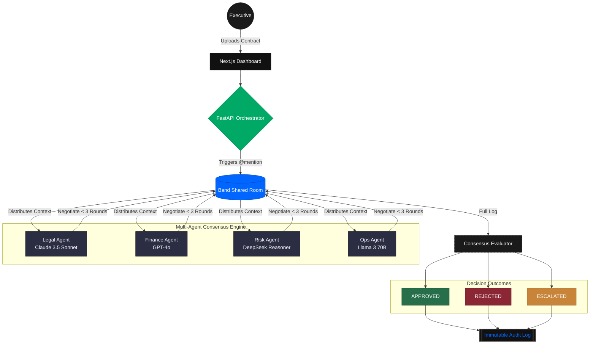

<div align="center">
  
  <h1>Cordane.</h1>
  <p><b>Four agents. One verdict. No more email chains.</b></p>
  
  <p>
    
    
    
    
  </p>

  <p>
    
    
    
  </p>

  <p>
    <a href="https://cordane-theta.vercel.app"><b>Live Demo</b></a>
  </p>
</div>

---

## The Problem

Enterprise contract approvals stall not because people don't care — but because Legal doesn't know what Finance flagged, and Risk doesn't know what Ops needs.

The average vendor contract takes **eleven days** to clear internal review. Eleven days of Slack threads, reply-all emails, and missed deadlines. Nobody reads what the other department surfaced. The contract sits in someone's inbox.

Cordane puts Legal, Finance, Risk, and Ops in the same room — and makes them actually talk to each other.

---

## What Cordane Does

You submit a vendor contract. Four specialized AI agents read it simultaneously, then negotiate through a **Band shared room** — each agent reading what the others flag and recalibrating in real time.

They don't run in parallel and dump four separate reports. They react to each other. When Legal flags an uncapped liability clause, Risk reads it and elevates its threat score. When Finance recalculates the budget threshold, Ops adjusts its integration assessment. The dependencies are real, not theatrical.

**Three possible outputs:**
- **Approved** — agents reached consensus, full audit trail attached
- **Rejected** — specific clause or constraint blocked consensus, exact reason surfaced
- **Escalated** — agents couldn't agree after 3 rounds; human gets a precise summary of what's blocking and what each agent needs

One verdict. One audit trail. One action.

---

## Agent Roster

| Agent | Model | Provider | Role |
|:---|:---|:---|:---|
| **Legal** | `claude-3-5-sonnet-20240620` | AI/ML API | Parses contract language, flags liability terms, data ownership clauses, indemnification risks |
| **Finance** | `gpt-4o` | AI/ML API | Checks payment terms, cost thresholds, margin calculations, flags budget conflicts |
| **Risk** | `deepseek-reasoner` | AI/ML API | Scores vendor reliability, flags concentration risk, OFAC/GDPR compliance gaps |
| **Ops** | `meta-llama/Llama-3-70b-instruct` | AI/ML API | Assesses integration feasibility, timeline realism, team capacity blockers |

Each model was selected for the specific cognitive task of that agent — not by popularity. Claude leads every legal benchmark for clause identification and ambiguous language interpretation. GPT-4o handles numerical precision. DeepSeek-Reasoner is built for chain-of-thought multi-factor scoring. Llama 3 70B handles practical operational reasoning at speed.

---

## Why Band Is the Backbone — Not a Wrapper

This is the architectural decision that makes Cordane an intriguing multi-agent system.

Most systems run agents in parallel, collect their outputs, and push a summary to Band at the end. That's a notification channel.

In Cordane, **every agent-to-agent handoff goes through Band's shared room**. The Finance agent cannot set its budget threshold without reading what Legal posted. The Risk agent cannot calibrate its threat score without Finance's constraints. Band is not where results are reported — it's where the negotiation happens.

When looking at the Band room logs, you will see a real conversation: agents reading each other's context, posting structured responses, and changing their positions based on what they read. That's the collaboration criterion. Clearly demonstrated.

---

## System Architecture



---

## How Decisions Are Made

1. Each agent reads the contract and the full Band room history before responding
2. If any agent flags a hard constraint — uncapped liability, budget way over threshold, compliance failure — it blocks approval
3. Agents get up to 3 rounds to negotiate and adjust their positions
4. If a blocker remains after round 3, the system escalates to a human with a clear breakdown of what's stuck
5. The human can approve anyway, reject, or send it back for revision

Cordane never silently approves a dangerous contract. It never hallucinates a compromise.

---

## Demo Scenarios

Each scenario produces a genuinely different outcome — proving Cordane reasons, not scripts:

| Scenario | Contract Profile | Expected Outcome |
|:---|:---|:---|
| **A — Clean Approve** | Standard terms, budget within threshold, reliable vendor, realistic timeline | Agents reach consensus in round 1. Fast approval. |
| **B — Clear Reject** | Uncapped liability, budget 4x over threshold, vendor has no track record | Legal and Risk block in round 1. Escalate with reject recommendation. |
| **C — Ambiguous** | One fixable clause, slightly over budget, mid-tier vendor | Round 2 negotiation. Conditional approval with one contract amendment. |

---

## Tech Stack

| Layer | Technology |
|:---|:---|
| Agent coordination | Band SDK (Python) — shared room, structured context |
| Agent inference | AI/ML API — unified gateway for all four models |
| Backend | Python 3.11 + FastAPI + Pydantic V2 |
| Frontend | Next.js 14 + Tailwind CSS + Framer Motion |
| Deployment | Render (backend) + Vercel (frontend) |

---

## Project Structure

```
cordane/
├── api/
│   ├── server.py                        # FastAPI app + /api/negotiate endpoint
│   ├── evaluators/
│   │   ├── base.py                      # AI/ML API client, model routing
│   │   └── tribunes.py                  # Agent definitions + Band room posting
│   └── orchestration/
│       ├── mesh_state.py                # Shared state registry
│       ├── cordane_optimized_mesh.py    # Negotiation rounds orchestrator
│       └── cordane_global_sentinel.py   # Pre-flight contract validation
├── frontend/
│   ├── src/app/
│   │   ├── page.tsx                     # Landing page
│   │   ├── platform/page.tsx            # Negotiation room
│   │   └── dashboard/page.tsx           # User dashboard
├── render.yaml
└── README.md
```

---

## Local Setup

### Backend

```bash
cd api
pip install -r requirements.txt

# .env
AIML_API_KEY=your_key_here
BAND_API_KEY=your_key_here

uvicorn server:app --reload
```

### Frontend

```bash
cd frontend
npm install

# .env.local
NEXT_PUBLIC_API_URL=http://localhost:8000

npm run dev
```

---

## Built By

Team **Stratum** · Band of Agents Hackathon 2026
[github.com/HillaryIkhais](https://github.com/HillaryIkhais)

---

<div align="center">
  <p><i>Surface every risk. Resolve every conflict. Sign the right contracts.</i></p>
  <p><b>Cordane.</b></p>
</div>
